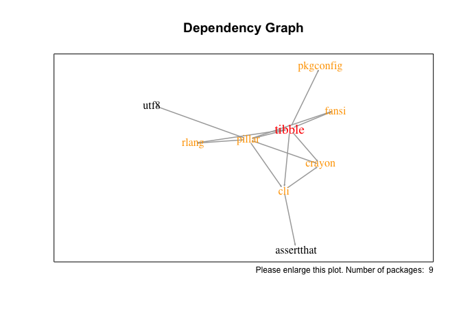

<!-- README.md is generated from README.Rmd. Please edit that file -->
dstr - Dependency Structure Analysis
====================================

Package Description
-------------------

dstr reveals the dependency structure of one or several given R package/s. It is meant as a tool for package developers to see which packages are loaded beyond those in the DESCRIPTION file (all dependencies of dependencies of...), how dependencies are connected, and how easy or hard it would be to remove certain packages from the dependency structure completely. The last section of this README is example output.

Setup
-----

``` r
library(devtools)
install_github("falo0/dstr")
library(dstr)
```

Usage
-----

Use Case: The dependency structure of a package in the current working directory has to be analyzed

``` r
dstr()
plotdstr()
dstr_data(outtype = "all")
```

Use Case: The dependency structure of a package on github has to be analyzed. Accepting multiple gihub link formats

``` r
dstr("Stan125/GREA")
plotdstr("https://github.com/Stan125/GREA")
View(dstr_data("https://github.com/Stan125/GREA/blob/master/DESCRIPTION",
               outtype = "tree"))
```

Use Case: The dependency structure of one or several packages on CRAN have to be analyzed, including base packages

``` r
dstr(pkg = "ggplot2", includebasepkgs = T)
plotdstr(pkg = "ggplot2", includebasepkgs = T)
View(dstr_data(pkg = "ggplot2", outtype = "tree", includebasepkgs = T))
```

Use Case: What would happen to the dependency structure, if a certain package on github would also depend on some more CRAN packages?

``` r
dstr("Stan125/GREA", pkg = c("astro", "celestial"))
plotdstr("Stan125/GREA", pkg = c("astro", "celestial"))
```

Use Caes: The user wants certain data about the dependency structure to use for his own analysis

``` r
data <- dstr_data("Stan125/GREA",
                  outtype = c("root", "lvl1", "all",
                              "tree", "list", "unique", "unique2",
                              "edgelist", "edgelist2", "network"))
# Key data about the dependency structure
data$root
data$lvl1
data$all
data$tree
# Dependencies per first level dependency
data$list
data$unique
data$unique2
# For plotting and network analysis
data$edgelist
data$edgelist2
data$network
```

Example Output
--------------

Text Summary:

``` r
dstr("tidyverse/tibble")
```

    ## Loading...
    ## 
    ## --- [dstr] DEPENDENCY STRUCTURE ANALYSIS OF 'tibble' ---
    ## Base packages are ignored in this analysis.
    ## 
    ## 
    ## First Level Dependencies (Packages Found In The DESCRIPTION File) (6)
    ## --------------------------------------------------------------------------------
    ## [1] "cli"       "crayon"    "fansi"     "pillar"    "pkgconfig" "rlang"    
    ## 
    ## 
    ## All 8 Eventually Loaded Packages (Dependencies Of Dependencies Of...)
    ## --------------------------------------------------------------------------------
    ## [1] "cli"        "crayon"     "fansi"      "pillar"     "pkgconfig" 
    ## [6] "rlang"      "assertthat" "utf8"      
    ## 
    ## 
    ## Opportunities To Reduce Dependencies (Iterating Through All First Level Dependencies)
    ## --------------------------------------------------------------------------------
    ## If you remove 'pillar' you will remove the following 2 packages completely:
    ## [1] "pillar" "utf8"  
    ## 
    ## 
    ## If you remove 'pkgconfig' you will remove the following 1 package completely:
    ## [1] "pkgconfig"
    ## 
    ## 
    ## If you remove 'cli' you will remove 0 other packages and also not 'cli' istelf because it is a deeper level dependency from the following first level dependencies:
    ## [1] "pillar"
    ## 
    ## 
    ## If you remove 'crayon' you will remove 0 other packages and also not 'crayon' istelf because it is a deeper level dependency from the following first level dependencies:
    ## [1] "cli"    "pillar"
    ## 
    ## 
    ## If you remove 'fansi' you will remove 0 other packages and also not 'fansi' istelf because it is a deeper level dependency from the following first level dependencies:
    ## [1] "pillar"
    ## 
    ## 
    ## If you remove 'rlang' you will remove 0 other packages and also not 'rlang' istelf because it is a deeper level dependency from the following first level dependencies:
    ## [1] "pillar"
    ## 
    ## 
    ## Shared Dependencies / Hard To Remove
    ## --------------------------------------------------------------------------------
    ## 2 first level packages ('cli', pillar') depend on the following packages:
    ## [1] "crayon"     "assertthat"

Network Plot:

``` r
plotdstr("tidyverse/tibble")
```

    ## Loading...



Receiving specific information about the dependency structure. Use the help page (?dstr\_data) to see a description of all 11 possible outtypes.

``` r
dstr_data("tidyverse/ggplot2", outtype = c("root", "all"))
```

    ## $root
    ## [1] "ggplot2"
    ## 
    ## $all
    ##  [1] "digest"       "gtable"       "lazyeval"     "MASS"        
    ##  [5] "mgcv"         "plyr"         "reshape2"     "rlang"       
    ##  [9] "scales"       "tibble"       "viridisLite"  "withr"       
    ## [13] "Matrix"       "nlme"         "lattice"      "Rcpp"        
    ## [17] "stringr"      "glue"         "magrittr"     "stringi"     
    ## [21] "labeling"     "munsell"      "R6"           "RColorBrewer"
    ## [25] "colorspace"   "cli"          "crayon"       "pillar"      
    ## [29] "assertthat"   "fansi"        "utf8"
